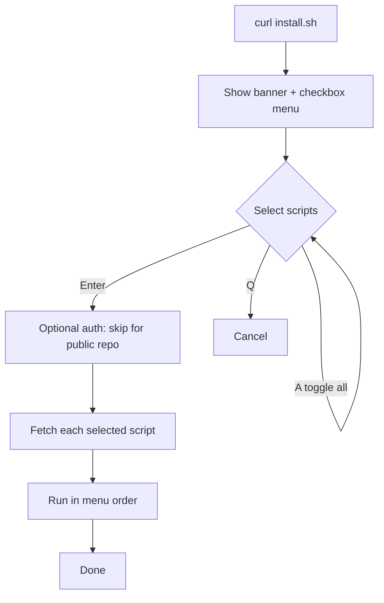

# wanforge.asia — Server Scripts

A collection of Linux server setup and hardening scripts. Run them individually,
or use the interactive launcher `install.sh` which shows a grouped multi-select
checkbox menu and runs the chosen scripts in order.

This is a public repository, so no authentication is required to run the scripts.

## Requirements

- A Linux system with one of these package managers: `apt`, `dnf`, `yum`,
  `pacman`, `zypper`, or `apk`. Some scripts are Debian/Ubuntu only (noted below).
- `curl` and `sudo` access (or run as root). Node.js and Composer install
  user-local and do not use `sudo`.
- An interactive terminal (scripts read input from `/dev/tty`).

## Run via the Launcher

```bash
curl -fsSL https://raw.githubusercontent.com/wanforge/server-mine/main/install.sh | bash
```

Menu controls:

| Key            | Action                       |
| -------------- | ---------------------------- |
| Up / Down      | Move between rows            |
| Space          | Toggle a selection           |
| A              | Toggle all                   |
| Enter          | Run the selected scripts     |
| Q              | Cancel and exit              |

The menu is grouped by category and runs the selected scripts in menu order. If
one fails, the rest still continue. No authentication is needed — this is a
public repository.

```text
Select scripts to run:  ↑/↓ move · SPACE toggle · A all · ENTER run · Q quit

── System ──
❯ [ ] install-packages     Update system + install base packages (multi-distro)
  [ ] set-timezone         Set timezone (default Asia/Jakarta)
── Security ──
  [ ] install-firewall     Install & configure ufw firewall
  [ ] firewall-manager     Full ufw manager: allow/deny IP/port, multiple, rate-limit
  [ ] install-fail2ban     Install & enable Fail2Ban
  [ ] secure-ssh           Harden SSH: change port, disable root/password, pubkey
  [ ] generate-ssh-key     Generate an ed25519 SSH key (user-local)
── Panel & Console ──
  [ ] install-cloudpanel   Install CloudPanel CE v2 (Debian/Ubuntu only)
  [ ] clpctl-manager       Manage CloudPanel via clpctl (sites, db, users, certs)
  [ ] install-cockpit      Install Cockpit web console + modules (Debian/Ubuntu)
── Database ──
  [ ] install-postgresql   Install PostgreSQL + create roles + remote access
  [ ] enable-mysql-remote  Allow remote MySQL/MariaDB access (sensitive)
  [ ] database-toolkit     Monitor, optimize, config, datetime (MySQL/PostgreSQL)
── App Runtime ──
  [ ] install-nodejs       Install Node.js via nvm (user-local) + PM2
  [ ] install-composer     Install Composer (user-local, signature-verified)
  [ ] setup-pm2-app        Configure pm2-logrotate + register an app (ecosystem)
── Monitoring ──
  [ ] monitor-system       CPU, RAM, storage, processes, network (snapshot or realtime)
```

## Output Modes

Every script shares one verbosity control (defined in `lib.sh`). Set it with an
environment variable (recommended — it also propagates through the launcher) or
a flag:

| Mode      | Shows                                   | How                                   |
| --------- | --------------------------------------- | ------------------------------------- |
| `silent`  | Errors and final result only, no banner | `MODE=silent` · `QUIET=1` · `-q`      |
| `normal`  | Banner + info/ok/warn/err (default)     | `MODE=normal` (default)               |
| `verbose` | Normal + extra `dbg` detail             | `MODE=verbose` · `VERBOSE=1` · `-v`   |
| `debug`   | Verbose + shell trace (`set -x`)        | `MODE=debug` · `DEBUG=1` · `--debug`  |

```bash
# silent (good for automation / cron)
curl -fsSL https://raw.githubusercontent.com/wanforge/server-mine/main/install.sh | MODE=silent bash

# verbose
curl -fsSL .../script/monitor-system.sh | VERBOSE=1 bash
```

### Dry-run (all scripts)

`DRY_RUN=1` (or `--dry-run` / `-n`) makes every script **print** the
state-changing commands instead of running them — defined once in `lib.sh`, so
it works the same everywhere:

```bash
curl -fsSL .../script/install-fail2ban.sh | DRY_RUN=1 bash
# →  [dry-run] sudo apt-get install -y fail2ban
#    [dry-run] sudo systemctl start fail2ban
```

Dry-run covers system mutations: package managers (install/upgrade/remove),
services (`systemctl`/`rc-service`), `ufw`, `sed -i`, `tee` config writes,
`timedatectl`, file ops, and PostgreSQL `VACUUM`/`REINDEX`. Read-only commands
still run so you see real state. A few user-local installs (nvm/Node, Composer,
PM2) and MySQL client mutations execute as normal.

### Automation & logging

| Variable / flag                | Effect                                                        |
| ------------------------------ | ------------------------------------------------------------ |
| `ASSUME_YES=1` · `YES=1` · `-y`| `ask` returns the default answer without prompting (non-interactive) |
| `LOG_FILE=/path`               | Appends a plain-text (no-color) copy of every log line       |
| `NO_COLOR=1`                   | Disables colors in any mode                                  |

```bash
# fully unattended, dry-run, logged
curl -fsSL .../script/install-fail2ban.sh | ASSUME_YES=1 DRY_RUN=1 LOG_FILE=/var/log/wf.log bash
```

Note: `ASSUME_YES` only fills prompts that have a safe default; password prompts
and free-text inputs (e.g. role names) still need real input or are skipped.

### Target user (install for a CloudPanel / site user)

The user-local scripts (`install-nodejs`, `install-composer`, `setup-pm2-app`)
install into a user's home — not the system. When you run them as **root**, they
ask which user to install for (or set `TARGET_USER=<name>` / `--user=<name>`) and
re-run themselves as that user via `sudo -u`, so Node/Composer/PM2 land in that
user's home. Perfect for CloudPanel site users:

```bash
# install Node + PM2 into the CloudPanel site user 'john'
curl -fsSL .../script/install-nodejs.sh | TARGET_USER=john bash
```

All menus (launcher and the `clpctl` / database / firewall managers) are
arrow-key TUIs — `↑/↓` to move, `ENTER` to select, `Q` to go back.

## Run a Single Script

Each script can also be run directly without the launcher.

```bash
# System & base
curl -fsSL https://raw.githubusercontent.com/wanforge/server-mine/main/script/install-packages.sh | bash
curl -fsSL https://raw.githubusercontent.com/wanforge/server-mine/main/script/set-timezone.sh | bash

# Security
curl -fsSL https://raw.githubusercontent.com/wanforge/server-mine/main/script/install-firewall.sh | bash
curl -fsSL https://raw.githubusercontent.com/wanforge/server-mine/main/script/firewall-manager.sh | bash
curl -fsSL https://raw.githubusercontent.com/wanforge/server-mine/main/script/install-fail2ban.sh | bash
curl -fsSL https://raw.githubusercontent.com/wanforge/server-mine/main/script/secure-ssh.sh | bash
curl -fsSL https://raw.githubusercontent.com/wanforge/server-mine/main/script/generate-ssh-key.sh | bash

# Panels & consoles
curl -fsSL https://raw.githubusercontent.com/wanforge/server-mine/main/script/install-cloudpanel.sh | bash
curl -fsSL https://raw.githubusercontent.com/wanforge/server-mine/main/script/clpctl-manager.sh | bash
curl -fsSL https://raw.githubusercontent.com/wanforge/server-mine/main/script/install-cockpit.sh | bash

# Databases
curl -fsSL https://raw.githubusercontent.com/wanforge/server-mine/main/script/install-postgresql.sh | bash
curl -fsSL https://raw.githubusercontent.com/wanforge/server-mine/main/script/enable-mysql-remote.sh | bash
curl -fsSL https://raw.githubusercontent.com/wanforge/server-mine/main/script/database-toolkit.sh | bash

# Monitoring
curl -fsSL https://raw.githubusercontent.com/wanforge/server-mine/main/script/monitor-system.sh | bash

# App runtime
curl -fsSL https://raw.githubusercontent.com/wanforge/server-mine/main/script/install-nodejs.sh | bash
curl -fsSL https://raw.githubusercontent.com/wanforge/server-mine/main/script/install-composer.sh | bash
curl -fsSL https://raw.githubusercontent.com/wanforge/server-mine/main/script/setup-pm2-app.sh | bash
```

## Scripts Overview

| Group         | Script                   | Purpose                                                          | Sudo | Distro          |
| ------------- | ------------------------ | ---------------------------------------------------------------- | ---- | --------------- |
| —             | `install.sh`             | Grouped checkbox launcher that runs the other scripts            | —    | Any             |
| System        | `install-packages.sh`    | Update/upgrade system, install base packages                     | Yes  | Multi           |
| System        | `set-timezone.sh`        | Set timezone via `timedatectl` (default `Asia/Jakarta`)          | Yes  | Any (systemd)   |
| Security      | `install-firewall.sh`    | Install `ufw`, open SSH/http/https, add custom ports, enable     | Yes  | Mainly Deb/Ubu  |
| Security      | `firewall-manager.sh`    | Full ufw manager: allow/deny IP & port, multi-IP, rate-limit     | Yes  | Any (ufw)       |
| Security      | `install-fail2ban.sh`    | Install and enable the Fail2Ban service                          | Yes  | Multi           |
| Security      | `secure-ssh.sh`          | Change SSH port, disable root/password login, enable pubkey      | Yes  | Any (OpenSSH)   |
| Security      | `generate-ssh-key.sh`    | Generate an ed25519 SSH key, fix perms, print public key         | No   | Any             |
| Panel & Console | `install-cloudpanel.sh`| Install CloudPanel CE v2, choose DB engine, verify checksum      | Yes  | Debian/Ubuntu   |
| Panel & Console | `clpctl-manager.sh`    | Manage CloudPanel via `clpctl`: sites, db, users, certs, vhosts  | Yes  | CloudPanel      |
| Panel & Console | `install-cockpit.sh`   | Install Cockpit + modules, reverse-proxy config, open port 9090  | Yes  | Debian/Ubuntu   |
| Database      | `install-postgresql.sh`  | Install latest PostgreSQL (PGDG), create roles, remote access    | Yes  | Debian/Ubuntu   |
| Database      | `enable-mysql-remote.sh` | Remote MySQL/MariaDB: bind-address, firewall, create users       | Yes  | Debian/Ubuntu   |
| Database      | `database-toolkit.sh`    | Monitor / optimize / config / datetime — MySQL & PostgreSQL      | Yes  | Any (DB client) |
| App Runtime   | `install-nodejs.sh`      | Install Node.js via nvm (user-local), choose version, PM2        | No   | Any             |
| App Runtime   | `install-composer.sh`    | Install Composer to `~/.local/bin`, verify signature             | No   | Any (needs PHP) |
| App Runtime   | `setup-pm2-app.sh`       | Configure pm2-logrotate + register an app (ecosystem.config.js)  | No   | Any             |
| Monitoring    | `monitor-system.sh`      | CPU/RAM/storage/processes/network — snapshot or realtime watch          | Some | Any             |

## Script Details

### install-packages.sh

- Detects the package manager: `apt`, `dnf`, `yum`, `pacman`, `zypper`, `apk`.
- **Grouped checkbox menu** (default all on, uncheck to skip): System actions
  (update / upgrade / cleanup) plus per-package selection grouped by Editor,
  Network, VCS, Diagnostics, and Python — each with a description.
- Package names are resolved per distro; falls back to `pip3` for
  `speedtest-cli` where the repo package is missing.

### set-timezone.sh

- Sets the timezone with `timedatectl`. Default `Asia/Jakarta`.
- Type `s` / `skip` to skip, or enter any valid zone (e.g. `UTC`, `Europe/London`).

### install-firewall.sh

- Installs `ufw` if missing, allows OpenSSH, http, https.
- Prompts for extra ports (e.g. `8443/tcp 3000/tcp`).
- Optionally enables the firewall and shows verbose status.

### firewall-manager.sh

- Full interactive `ufw` manager (installs ufw if missing). Looping menu:
  - **View & control**: status (verbose + numbered), enable, disable, reload,
    reset, default policy (incoming/outgoing/routed × allow/deny/reject), logging level.
  - **Ports**: allow port, deny port, rate-limit port (brute-force protection).
  - **IP / subnet**: allow IP/CIDR, deny IP/CIDR, **allow multiple IPs**, **deny
    multiple IPs** (space/comma separated), allow IP→port, deny IP→port.
  - **Apps & rules**: list/allow application profiles, delete a rule by number.
- Addresses are validated; multiple-IP actions report applied/skipped counts.
- Warns to allow your SSH port before enabling, to avoid lockout.
- **Dry-run**: set `DRY_RUN=1` to print every `ufw` command without executing —
  safe to try the menus and inputs first:

  ```bash
  curl -fsSL https://raw.githubusercontent.com/wanforge/server-mine/main/script/firewall-manager.sh | DRY_RUN=1 bash
  ```

### install-fail2ban.sh

- Installs Fail2Ban via the detected package manager.
- Enables and starts the service (systemd or OpenRC).

### secure-ssh.sh

- Changes the SSH port (default `22` — keep it or set a custom one), disables
  root login, optionally disables password auth, enables pubkey auth.
- Uses a drop-in file under `sshd_config.d/` when `Include` is active, otherwise
  edits the main config. Backs up `sshd_config` first.
- **Anti-lockout**: opens the new port in `ufw` before restarting, validates with
  `sshd -t`, and refuses to disable password auth when no `authorized_keys` exists.
- Asks before restarting and before removing the old port-22 rule.

### generate-ssh-key.sh

- Generates an `ed25519` key in `~/.ssh` (no sudo). Prompts for the file path,
  comment (default `wanforge-asia@<hostname>`), and an optional passphrase.
- Refuses to overwrite an existing key without confirmation. Sets `~/.ssh` to
  `700`, the private key to `600`, the public key to `644`.
- Prints the fingerprint and the public key to paste into GitHub/GitLab
  (Settings → SSH/Deploy Keys).

### install-cloudpanel.sh

- Debian/Ubuntu only. Installs prerequisites, lets you choose the database engine
  (`MARIADB_11.4`, `MARIADB_10.11`, `MYSQL_8.4`, `MYSQL_8.0`).
- Downloads the official installer and verifies its SHA-256 checksum. **Fails
  closed** on mismatch. Update `EXPECTED_SHA` from the CloudPanel docs for new
  releases. Web console at `https://<server-ip>:8443`.

### clpctl-manager.sh

- Requires CloudPanel (`clpctl`). Interactive menu over the documented v2 CLI
  ([reference](https://www.cloudpanel.io/docs/v2/cloudpanel-cli/)). Loops until you quit.
- **CloudPanel**: enable/disable basic auth, Cloudflare IP update.
- **Database**: show master credentials, add, export, import.
- **Certificates**: Let's Encrypt install (with SAN), install custom certificate.
- **Sites**: add PHP / Node.js / Python / Static / Reverse Proxy, delete site.
- **Users**: add (admin/site-manager/user roles), delete, list, reset password,
  disable MFA.
- **vHost templates**: list, import, add, delete, view.
- **System**: reset permissions, purge Varnish cache.
- Passwords are entered interactively (not stored). Note they are passed to
  `clpctl` as flags, so they may briefly appear in the process list.

### install-cockpit.sh

- Debian/Ubuntu only. **Grouped checkbox menu** (default all on, uncheck to skip):
  - **Core** — install Cockpit; open port `9090` in `ufw` (skip if proxied).
  - **Proxy** — write `/etc/cockpit/cockpit.conf` with `AllowOrigins` (bare
    domain, e.g. `cockpit.domain.id` — TLS terminated by CloudPanel),
    `ProtocolHeader`, `AllowUnencrypted`. Add the domain in CloudPanel as a
    reverse proxy to `http://127.0.0.1:9090`.
  - **Network** — install NetworkManager and set the netplan renderer (with a
    backup and an explicit `yes` confirmation, since it can drop SSH).
  - **Plugins** — `networkmanager`, `storaged`, `sosreport`, `pcp`, `machines`,
    `podman` (each individually selectable).
  - **Metrics** — enable `pmcd` + `pmlogger`.
- Console at `http://127.0.0.1:9090`.

### install-postgresql.sh

- Debian/Ubuntu only. Adds the official **PGDG** APT repository to install the
  latest PostgreSQL, plus `postgresql-contrib`.
- Creates login roles interactively — usernames and passwords are entered at
  runtime and never stored in the script. Optional `SUPERUSER` (default off).
- Optional remote access: configures `pg_hba.conf` + `listen_addresses` (paths
  resolved via `SHOW hba_file/config_file`), restarts, and opens `5432` for a
  chosen source CIDR.

### enable-mysql-remote.sh

- Debian/Ubuntu only. Auto-detects the MySQL/MariaDB config file, backs it up,
  sets `bind-address = 0.0.0.0`, restarts the service, and opens `3306` for a
  chosen source CIDR.
- Optionally creates remote DB users: connects as admin (root socket via `sudo`,
  or a root password), then loops to create `user@host` with a password and a
  grant on a chosen database (or all). Host defaults to `%` (any client).
  Passwords are entered interactively and never stored.

### database-toolkit.sh

- Works with MySQL/MariaDB and PostgreSQL (auto-detects the client; asks which
  engine when both are present). Looping action menu.
- **MySQL/MariaDB**: status (version, uptime, threads, connections), databases
  by size, full process list, date/time + timezone check, key config variables,
  slow-query-log status, optimize + analyze (`mysqlcheck`), MySQLTuner.
- **PostgreSQL**: status (version, uptime, connections), databases by size,
  `pg_stat_activity`, date/time + timezone check, key settings, cache hit ratio,
  `VACUUM ANALYZE` + optional `REINDEX`.
- Connects via root socket (`sudo`) or a prompted password (MySQL) / the
  `postgres` system user (PostgreSQL). Read-only actions are safe; optimize
  actions modify tables.

### monitor-system.sh

- Grouped checkbox snapshot (default all on): uptime & load, CPU, memory, disk
  usage + inodes, largest directories, top processes by CPU/memory, network
  interfaces + listening sockets, temperatures (`lm-sensors`).
- **Realtime / watch mode**: refreshes the selected sections on an interval until
  `Ctrl-C`. Enable with the prompt, `WATCH=1`, or `-w`/`--watch`; set the cadence
  with `INTERVAL=<seconds>` (default 2). `bigdirs` is skipped while watching.
  Updates happen **in place** — the cursor homes and overwrites each line (no
  full-screen clear), so the values refresh without flicker or a "page reload".

  ```bash
  curl -fsSL .../script/monitor-system.sh | WATCH=1 INTERVAL=2 bash
  ```

- Optional **Tools** section installs `htop`, `btop`, `ncdu`, `glances`, `iotop`
  — full-screen realtime monitors if you prefer a TUI.

### install-nodejs.sh

- Installs `nvm` into `$HOME/.nvm` (no sudo) and the chosen Node version
  (`18`, `20`, `lts`, `latest`). Sets it as the default + stable alias.
- Optionally installs PM2 + `pm2-logrotate`, runs `pm2 save`, and (optionally)
  sets up boot startup via systemd (this single step needs sudo).

### install-composer.sh

- Requires PHP. Installs Composer into `~/.local/bin/composer` (no sudo),
  **verifying the installer SHA-384 signature** before running it.
- Adds `~/.local/bin` to `PATH` in `~/.bashrc` and runs `composer self-update`.

### setup-pm2-app.sh

- Requires PM2 (run `install-nodejs.sh` first). Sources nvm to find PM2.
- Optionally configures `pm2-logrotate` (max size, retention, compression, daily
  rotation).
- Registers an application by generating `ecosystem.config.js` (name, cwd, script,
  args, instances/cluster, `NODE_ENV`, memory restart limit), then runs
  `pm2 start` + `pm2 save`.

## Launcher Flow



## Security Notes

- **Public repo**: never store credentials, tokens, or sensitive data in this
  folder. See `.gitignore` for the blocked patterns.
- **Database credentials**: `install-postgresql.sh` asks for role names and
  passwords interactively. No passwords are stored in these scripts.
- **Remote database access**: `install-postgresql.sh` and `enable-mysql-remote.sh`
  expose the database to the network. Prefer a restricted source CIDR over
  `0.0.0.0/0`, and place the server behind a firewall or private network.
- **SSH hardening**: `secure-ssh.sh` can lock you out. It opens the new port in
  `ufw` before restarting, validates with `sshd -t`, backs up the config, and
  refuses to disable password auth without an `authorized_keys` present. Keep
  your current session open and test the new port before closing it.
- **CloudPanel**: fails closed when the installer checksum does not match.
- **Cockpit**: `AllowUnencrypted = true` is only safe when TLS is terminated by
  the proxy (e.g. CloudPanel) in front of Cockpit.
- **Node.js / Composer**: installed in the current user's home, no `sudo`. PM2
  boot startup (`pm2 startup`) is optional and needs `sudo` for systemd.
- **Disable colors**: set `NO_COLOR=1` before running.

## Shared library

The banner, colors, logging helpers (`info`/`ok`/`warn`/`err`/`hd`), prompts
(`ask`/`asks`), and the grouped `checkbox` menu live once in
[`script/lib.sh`](script/lib.sh). Every script sources it:

```bash
TASK="my-script"
__LIB="https://raw.githubusercontent.com/wanforge/server-mine/main/script/lib.sh"
__d="$(cd "$(dirname "${BASH_SOURCE[0]:-$0}")" 2>/dev/null && pwd || true)"
if [ -r "${__d}/lib.sh" ]; then . "${__d}/lib.sh"
else . <(curl -fsSL "${__LIB}"); fi
```

It uses the local sibling `lib.sh` when present (cloned repo), otherwise fetches
it from the same public repo over HTTPS. Set `TASK` before sourcing — the banner
subtitle uses it. To add a script, copy this header, fill in `TASK`, write your
logic with the shared helpers, and register it in `install.sh`.

## License

GNU General Public License v3.0 (GPL-3.0). Copyright (c) 2026 Sugeng Sulistiyawan.
See [`LICENSE`](LICENSE).
